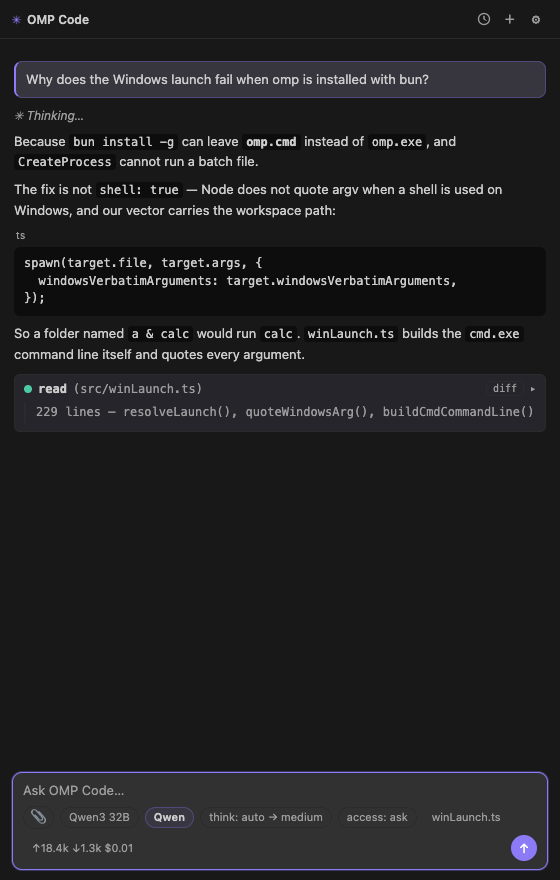
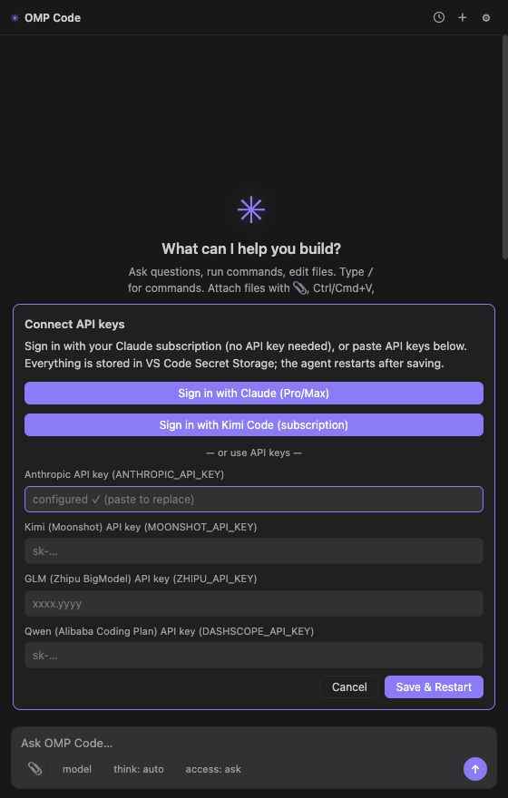
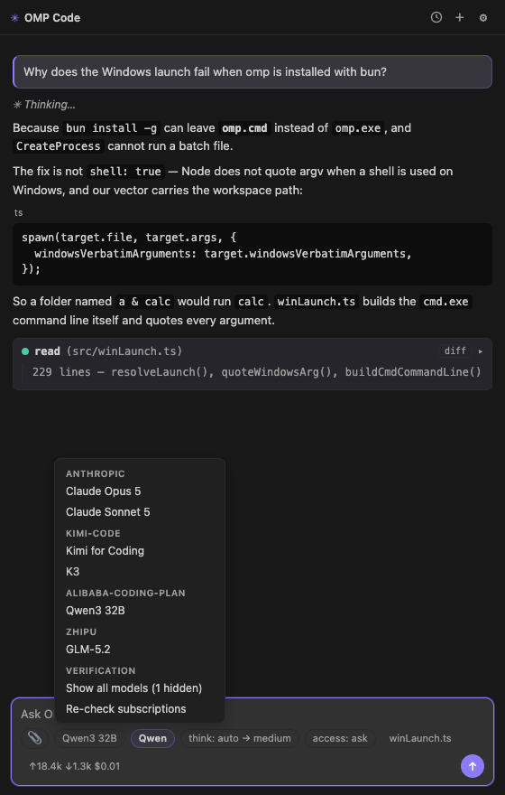
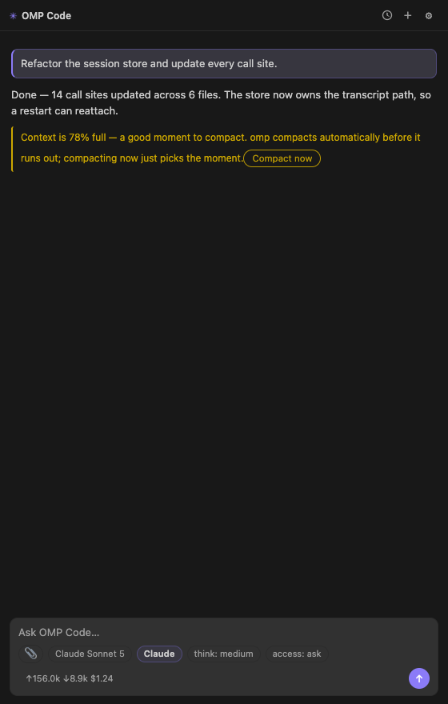
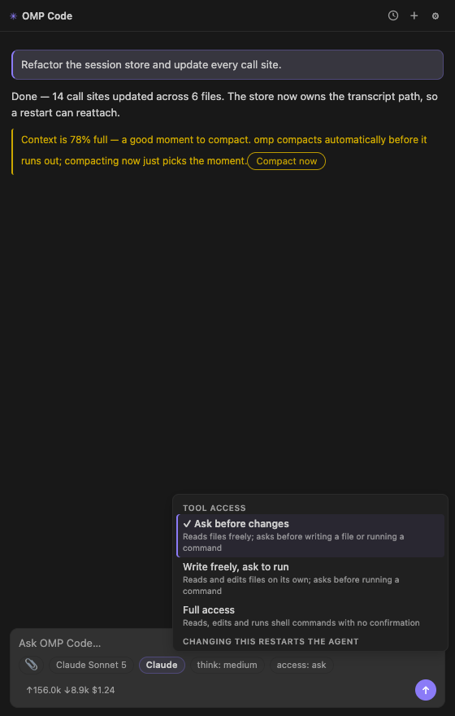
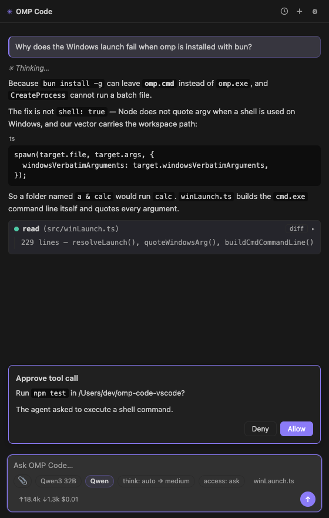
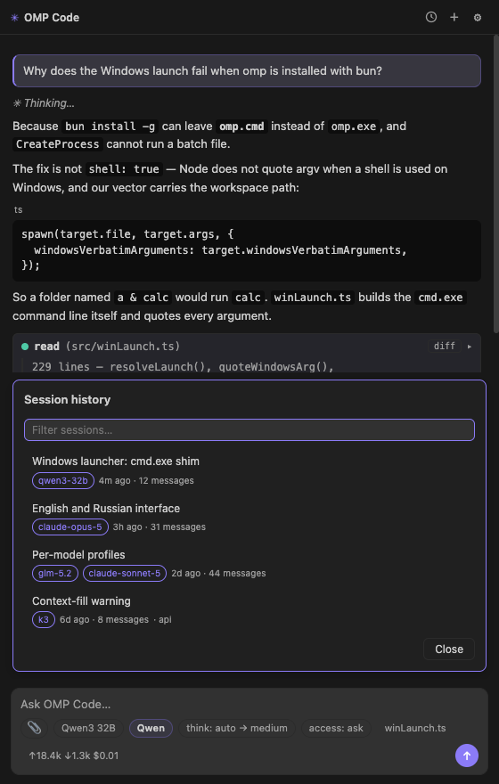
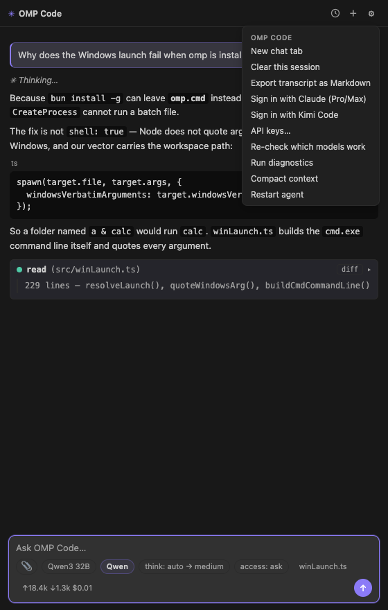
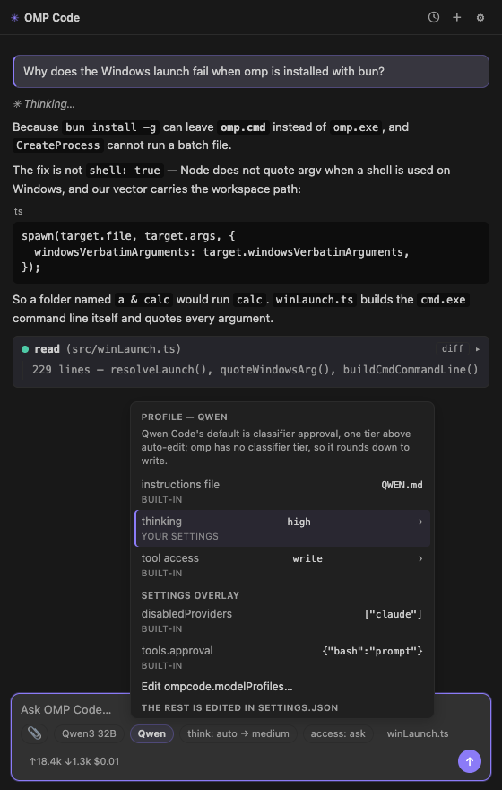
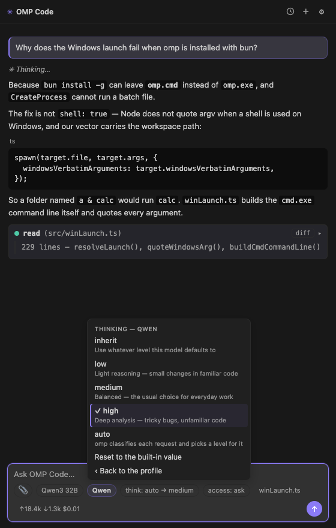

# OMP Code

[](https://github.com/cryptotyan-star/omp-code-vscode/actions/workflows/ci.yml)
[](LICENSE)
[](https://code.visualstudio.com/)

**A Claude Code-style coding agent inside VS Code — running on whichever model you already pay for.**

🇷🇺 [Русская версия](README.ru.md)

<p align="center">
  
</p>

OMP Code is a chat panel for the [`omp`](https://www.npmjs.com/package/@oh-my-pi/pi-coding-agent)
(oh-my-pi) coding agent. It reads and edits your files, runs commands, and answers with
streaming markdown — the same shape of workflow as Claude Code, except the model behind it
is your choice: Claude, GLM, Qwen, Kimi, or any OpenAI-compatible endpoint you point it at.

> The extension is a **GUI and nothing else**. Every model call, tool call and session
> belongs to the `omp` CLI, which you install separately — without that binary the panel
> does not start. That also means your keys and your code go exactly where `omp` sends
> them, and nowhere else: this extension has no server, no telemetry and no account.

> **Not affiliated** with the oh-my-pi project, Anthropic, or any model provider. This is
> an independent client that talks to the `omp` CLI over its RPC interface.

---

## Contents

- [What you get](#what-you-get)
- [Spending less](#spending-less)
- [Install](#install)
- [Sign in](#sign-in)
- [Features in detail](#features-in-detail)
- [Model profiles](#model-profiles)
- [Settings](#settings)
- [Commands and shortcuts](#commands-and-shortcuts)
- [Custom providers](#custom-providers)
- [Language](#language)
- [Platforms](#platforms)
- [When something does not work](#when-something-does-not-work)

---

## What you get

| | |
| --- | --- |
| **One panel, any model** | Claude, GLM, Qwen, Kimi and custom OpenAI-compatible providers in one picker. Switch mid-conversation. |
| **Your subscription, not an API bill** | One-click OAuth for Claude Pro/Max and Kimi Code. No per-token key needed for those. |
| **Real cost, visible** | Tokens in, tokens out and dollars spent, updated after every turn. |
| **Dead models hidden** | Each model is probed once with a throwaway request; the ones answering 401 never reach the picker. |
| **Tool access on a leash** | Three tiers, from "ask before every change" to unattended. Per-tool rules if you want them. |
| **Model-family profiles** | A model behaves the way its own harness makes it behave — instruction file, reasoning level, approval tier. |
| **Sessions that survive** | Full history across workspaces, searchable, resumable. A crash reattaches instead of losing the chat. |
| **Cheap model, one prompt at a time** | Route the next prompt through any model in one click; the session snaps back afterwards. |
| **Undo an edit** | Every file the agent touches grows a `revert` button — one click restores the before-snapshot. |
| **All sessions, one board** | A sidebar list of every running chat: model, state, cost, with stop and close per row. |
| **Android Remote Control** | Continue an active desktop session from the companion phone app, with end-to-end encryption and explicit desktop grants. |
| **English and Russian** | Independent of the VS Code display language. |

---

## Spending less

Plain first: **this extension does not make tokens cheaper.** What it does is make what you
spend visible, and make it easy to send each piece of work to the cheapest thing that can
actually do it. Concretely:

**1. Use the subscription you already pay for.**
`Sign in with Claude (Pro/Max)` and `Sign in with Kimi Code` are OAuth flows — the agent
uses your existing plan rather than a metered API key. Nothing to top up, nothing to leak.

<p align="center"></p>

**2. Route the work to the cheap model, without the cheap model behaving badly.**
The picker groups every model your credentials actually unlock. Coding-plan models (Qwen,
GLM, Kimi) sit next to frontier ones, and [profiles](#model-profiles) make each family
behave the way its native tool does — so the cheap option is genuinely usable for the
routine 80% of a day, and you keep the expensive one for the part that needs it.

<p align="center"></p>

**3. Stop paying for reasoning you did not need.**
Reasoning tokens are billed like any other output. The `think:` chip sets the level per
session and a profile pins it per model family; `auto` hands the decision to omp, which
classifies each request instead of reasoning hard about everything.

**4. Know the bill before it arrives.**
The composer footer shows `↑input ↓output $cost` for the session, refreshed every turn.
Hovering adds reasoning tokens and cache reads, which is usually where a surprise hides.

**5. Do not blow the context window by accident.**
At 50%, 75% and 90% full the panel says so and offers a one-click compaction, rather than
letting a long session quietly grow into an expensive one.

<p align="center"></p>

**6. Do not burn turns on a stale credential.**
With `ompcode.verifyModels` on (the default), every model gets one tiny throwaway request
before it is offered, and the ones whose key or plan does not cover them are hidden. The
alternative — discovering a dead key three turns into a task — costs far more than the
probe. Verdicts are cached for 12 hours.

---

## Install

**1. Install the agent.** The extension is a GUI on top of it:

```bash
bun install -g @oh-my-pi/pi-coding-agent
```

No `bun`? `curl -fsSL https://bun.sh/install | bash`, then restart your terminal.
The extension finds `omp` on `PATH` (`~/.bun/bin` is added automatically); a custom
location goes in `ompcode.ompPath`.

**2. Install the extension.** Download the `.vsix` from
[Releases](https://github.com/cryptotyan-star/omp-code-vscode/releases), then either drop
it onto the Extensions view or run:

```bash
code --install-extension omp-code-<version>.vsix
```

Building from source instead:

```bash
git clone https://github.com/cryptotyan-star/omp-code-vscode.git
cd omp-code-vscode
npm install && npm run build && npm run package
```

**3. Open the chat.** The OMP Code icon in the activity bar, or `Cmd/Ctrl+Alt+O` for a
chat in an editor tab beside your code.

> Upgrading from a build older than 0.5.0? The extension id changed, so the new version
> installs *beside* the old one — two icons, every command twice. Remove the old one with
> `code --uninstall-extension local.omp-code` and reload the window.

---

## Sign in

Two ways, mixable:

**Subscription (OAuth).** `OMP Code: Sign in with Claude (Subscription)` or
`… with Kimi Code (Subscription)`, also on the ⚙ menu and the setup card. A browser tab
opens; if the provider asks for a code back, the panel shows one with a copy button. The
credential lands in the agent's own store, so it survives extension updates.

**API keys.** Anthropic, Kimi (Moonshot), GLM (Zhipu BigModel), OpenAI (ChatGPT), Qwen
(Alibaba Coding Plan) and GLM BigModel (pay-as-you-go) each have a palette command and a
field on the setup card. Keys live in **VS Code Secret Storage** — never in
`settings.json` — and are handed to the agent process as environment variables.

**GLM, twice over.** The two GLM rows are two different accounts, usable at the same
time. `GLM (Zhipu BigModel)` is the Coding Plan subscription (`ZHIPU_API_KEY`,
`open.bigmodel.cn/api/coding/paas/v4`). `GLM BigModel (pay-as-you-go)` is an open-platform
key from [bigmodel.cn/apikey](https://bigmodel.cn/apikey/platform), billed per token
against your balance — ten GLM models from 4.5 to 5.3, priced in the picker. omp has no
env var for that endpoint, so this one key is written into `~/.omp/agent/models.yml` when
the agent starts, and removed again when you clear it.

A key that starts returning 401 is called out with an offer to remove it, because a stale
key is worse than no key: the provider still advertises its whole model range and every
one of them fails.

---

## Features in detail

### The conversation

Streaming markdown with syntax highlighting, collapsible reasoning blocks, and a card per
tool call showing arguments, status and output. After an edit, the card grows a **diff**
button (before ↔ current) and a **revert** button — one click restores the file to its
pre-edit snapshot (a file the agent created is deleted again). Any new language-server
diagnostics surface as a warning, so you see what the agent broke without leaving the
panel.

Type `/` for the agent's slash commands, `@` to autocomplete a workspace file into the
prompt. Attach files with 📎, `Ctrl/Cmd+V`, or `Shift`-drag. `Cmd/Ctrl+Alt+L` sends the
current editor selection, line range and all. `Shift+Enter` is a newline, `Esc` interrupts
the turn.

### Tool access

Three tiers, changed from the `access:` chip and applied by restarting the agent.

<p align="center"></p>

| Tier | Reads | Writes files | Runs commands |
| --- | --- | --- | --- |
| `always-ask` | auto | asks | asks |
| `write` | auto | auto | asks |
| `yolo` | auto | auto | **auto** |

Anything that asks opens a dialog in the panel with the tool name and its arguments:

<p align="center"></p>

> One honest caveat: approving a single `task` call hands its subagent the same tier, so an
> approved task can run commands without asking again. Per-tool rules
> (`tools.approval` in a profile overlay) are enforced even under `yolo`, which is the
> reliable way to keep one tool locked.

### Route one prompt

The model menu has a **routing** entry: arm it and the composer shows a `route:` chip.
Pick any model there and only the *next* prompt goes through it — then the session snaps
back to the model it had. That is the "cheap model for the routine, expensive one for the
hard part" workflow without switching the whole conversation back and forth.

The switch never happens silently: if the routed model cannot be selected, the prompt is
not sent at all, and an interrupted turn restores the original model on the next one.

### Session history

Every session across every workspace, with a filter over title, preview, folder and model.
Picking one reattaches the agent to it and replays the transcript.

<p align="center"></p>

`Export transcript as Markdown` writes the whole conversation to a file.

### The session board

The **Sessions** view in the OMP Code sidebar lists every running chat — the sidebar one
plus every editor tab — with its model, its state (working, waiting for an approval,
idle), and the session cost. Clicking a row brings that chat to the front; a running row
gets an inline stop button, tabs get a close button.

### Workspaces (git worktrees)

A workspace is one git worktree, one branch and one agent of its own — the way to run
several agents on the same repository without them fighting over the same files.

**New Workspace** (the `$(git-branch)` button on the Sessions view) asks for a name, the
branch to start from, a model, a tool-access tier and an optional first prompt. It then
creates `<repo>.worktrees/<name>` beside the repository, branches `omp/<name>` at the
commit the base branch is on right now, runs the repo's setup commands and opens a chat
already pointed at that folder. The model and the tier belong to that workspace, not to
the window: changing the global default later leaves running agents where they are.

Rows appear on the Sessions board under **Workspaces**, with the branch, the model and
the live cost. A row's actions reveal the chat, open a terminal in the worktree, or
delete it; deleting names exactly what would be lost — uncommitted files, ignored files
such as `.env`, and commits that exist only on that branch — and asks before it does.
`OMP Code: Open Workspace in New Window`, `OMP Code: Run Workspace Setup` and the rest
are on the command palette.

A fresh worktree has no `node_modules`, no `.env` and no build output — git copies none
of it. Put the commands that fix that in `.ompcode/workspace.json` at the repository
root:

```json
{
  "setup": ["npm ci", "cp ../.env ."],
  "run": ["npm run dev"],
  "teardown": ["docker compose down"],
  "cwd": "."
}
```

Every field takes a single string or a list of them; `setup` commands are joined with
`&&` and run in a visible terminal, so a failing step stops the rest. `cwd` is relative
to the worktree. A repository already carrying Superset's `.superset/config.json` works
as-is — the format is the same (only the format: none of Superset's code is used).
`.ompcode/workspace.local.json` is the personal, git-ignored companion; its `before` and
`after` lists wrap the committed `setup` list, which is how you add a machine-specific
step without editing a file the whole team shares.

### Android Remote Control

Run **OMP Code: Start Android Remote Control**, choose the exact grant, then scan the
short-lived QR in the companion Android app. The phone reconnects to the same live
`omp` process while this computer and VS Code remain running; closing an editor tab does
not kill a session currently retained by Remote Control.

The desktop makes one outbound `wss://` connection. Session traffic is end-to-end
encrypted, the relay sees only opaque frames, credentials live in VS Code Secret
Storage, and network input goes through a closed command dispatcher — it is never
forwarded as raw RPC/stdin. The default grant covers only the current session; broader
session/settings and credential grants require explicit desktop selection. Use
**OMP Code: Stop and Revoke Remote Control** to rotate away the enrolled phone.

Phone uploads are encrypted in transit. After verification, a committed upload is
temporarily staged as a plaintext file in VS Code's extension global storage so the
local agent can read it; it is removed after the matching `agent_end`, explicit cancel,
or stale crash cleanup. Configure a self-hosted origin with `ompcode.remoteRelayUrl`;
plaintext `ws://` is accepted only on loopback.

### Everything else on the ⚙ menu

<p align="center"></p>

---

## Model profiles

A model behaves the way its own harness makes it behave. Claude Code reads `CLAUDE.md` and
approves conservatively; Qwen Code reads `QWEN.md` and defaults a tier looser; ZCode and
Kimi Code read `AGENTS.md` with their own reasoning defaults. Pick a model and OMP Code
applies that family's conventions instead of one flat setting for everything.

The badge next to the model chip names the family. Clicking it opens the inspector, which
shows every value **and where it came from** — built-in, or your settings:

<p align="center"></p>

`thinking` and `tool access` are editable in place: click the row, pick a value, and it is
written to `ompcode.modelProfiles` as a rule for that whole family.

<p align="center"></p>

> This is not the `think:` / `access:` chips in another shape. Those steer the **current
> session**; a profile is a standing rule for **every model of the family**, which is why
> changing one restarts the agent — warmly, with the conversation reattached.

A field you have overridden also offers *reset to the built-in value*. The overlay bag and
the instruction file stay in `settings.json`, one click away from the same menu.

Built-in families: `claude`, `glm`, `qwen`, `kimi`, plus a `generic` floor for anything
unmatched. Your own rows always win over the built-ins:

```jsonc
"ompcode.modelProfiles": [
  {
    "family": "qwen",
    "match": { "id": "qwen" },          // regex, as a string, case-insensitive
    "runtime": { "thinking": "high" },   // applied over RPC, no restart
    "spawn": {                           // reaches omp through argv — needs a restart
      "approvalMode": "always-ask",
      "overlay": {
        "disabledProviders": ["claude"],
        "tools.approval": { "bash": "deny" }   // enforced even under yolo
      }
    }
  }
]
```

Only policy belongs here. omp already resolves the thinking dialect, the effort ladder,
stream timeouts and tool-schema shape per provider — overriding those makes things worse.

---

## Settings

| Setting | Default | What it does |
| --- | --- | --- |
| `ompcode.ompPath` | `omp` | Path to the omp binary. |
| `ompcode.language` | `auto` | Chat language: `auto`, `en`, `ru`. |
| `ompcode.defaultModel` | `""` | `provider/modelId` selected on start, fuzzy matched. |
| `ompcode.verifyModels` | `true` | Probe each model once and hide the ones that fail. |
| `ompcode.thinkingLevel` | `auto` | `off`…`max`, or `auto`. |
| `ompcode.approvalMode` | `always-ask` | `always-ask`, `write`, `yolo`. |
| `ompcode.worktreeBaseDir` | `""` | Where workspace worktrees go; empty means `<repo>.worktrees`. |
| `ompcode.workspaceBranchPrefix` | `omp/` | Prefix for the branch a new workspace creates. |
| `ompcode.workspaceSetup` | `ask` | Run a workspace's setup commands: `auto`, `ask`, `never`. |
| `ompcode.modelProfiles` | `[]` | Per-family behaviour rows, layered over the built-ins. |
| `ompcode.customProviders` | `{}` | Extra providers merged into `models.yml`. |
| `ompcode.resumeLastSession` | `false` | New chats continue the most recent session. |
| `ompcode.hideStartupNotices` | `true` | Suppress the agent's boot chatter. |
| `ompcode.theme` | `violet` | Accent palette: violet, coral, emerald, amber, magenta. |
| `ompcode.accentColor` | `""` | Any CSS colour, overriding the palette. |

---

## Commands and shortcuts

| Shortcut | Action |
| --- | --- |
| `Cmd/Ctrl+Alt+O` | Open the chat in an editor tab |
| `Cmd/Ctrl+Alt+N` | New chat tab |
| `Cmd/Ctrl+Alt+L` | Send the editor selection to the chat |
| `Shift+Enter` | Newline in the composer |
| `Esc` | Interrupt the current turn |
| `↑` | Previous prompt |

All sixteen commands live under **OMP Code:** in the palette — sign-in, keys, models.yml,
diagnostics, restart, export, history.

---

## Custom providers

Any OpenAI-compatible endpoint, via `ompcode.customProviders`, merged into
`~/.omp/agent/models.yml` before each start (comments preserved):

```json
"ompcode.customProviders": {
  "akemi": {
    "baseUrl": "http://host:8000/v1",
    "api": "openai-completions",
    "models": [
      { "id": "akemi-1", "name": "Akemi", "contextWindow": 128000, "maxTokens": 32000 }
    ]
  }
}
```

Its API key belongs in Secret Storage, not the settings file:
`OMP Code: Set Custom Provider API Key`.

---

## Language

The interface ships in English and Russian. `ompcode.language` (`auto` by default) is
**separate from the VS Code display language**, so an English editor can hold a Russian
chat with no Language Pack installed. Command titles and setting descriptions are read by
VS Code before the extension loads, so those alone follow the editor.

---

## Platforms

Plain JavaScript, no native modules — the `.vsix` installs on macOS, Linux and Windows.
Only the `omp` CLI has native parts, and it ships `darwin-arm64`, `darwin-x64`,
`linux-x64`, `linux-arm64` and `win32-x64`. **Windows on ARM is not supported**, because
omp publishes no `win32-arm64` build.

On Windows a global install can leave `omp.cmd` rather than `omp.exe`. Since 0.5.0 the
extension resolves the path the way Windows does (`PATH` × `PATHEXT`) and starts a batch
shim through `cmd.exe`, quoting the command line itself — nothing to configure.

---

## When something does not work

Run **OMP Code: Run Diagnostics** from the palette. It reports the resolved binary path,
`omp --version`, whether the handshake completes, which providers hold a credential, which
models the agent offers and the last verification verdicts — with no key values in it,
so it is safe to paste into an issue.

The usual answers it gives:

- **"Cannot find the omp binary"** — the CLI is not installed, or not on the `PATH` VS Code
  sees. Set `ompcode.ompPath` to the full path.
- **Nothing answers, everything 401** — a stale key. Clear it with
  `OMP Code: Clear Stored API Key`; subscription sign-ins are unaffected.
- **The model list is short** — verification hid the ones that failed. The picker's
  *Show all models* reveals them, and *Re-check subscriptions* re-runs the probe.

---

## Contributing

See [CONTRIBUTING.md](CONTRIBUTING.md) — setup, the test suite, and the protocol details
that are expensive to rediscover. Release notes are in [CHANGELOG.md](CHANGELOG.md).

## License

[MIT](LICENSE) © BorisNers
