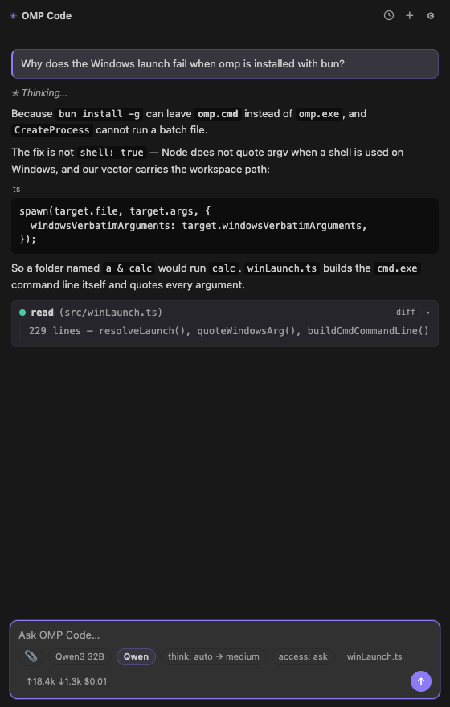
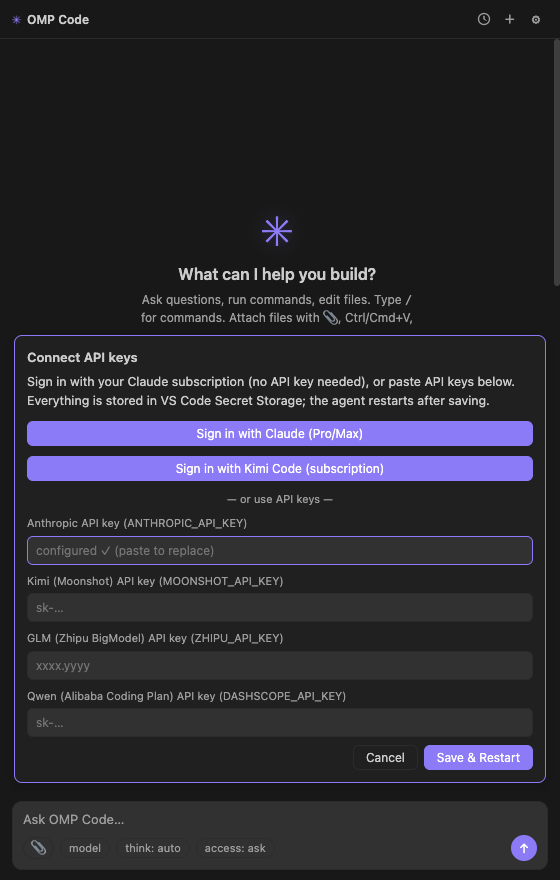
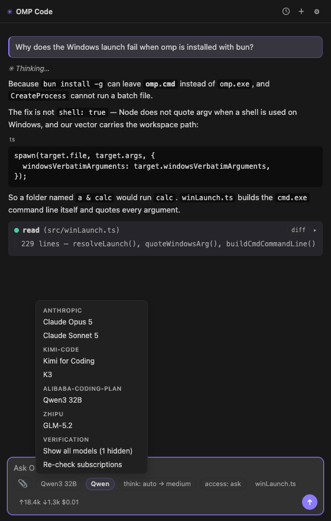
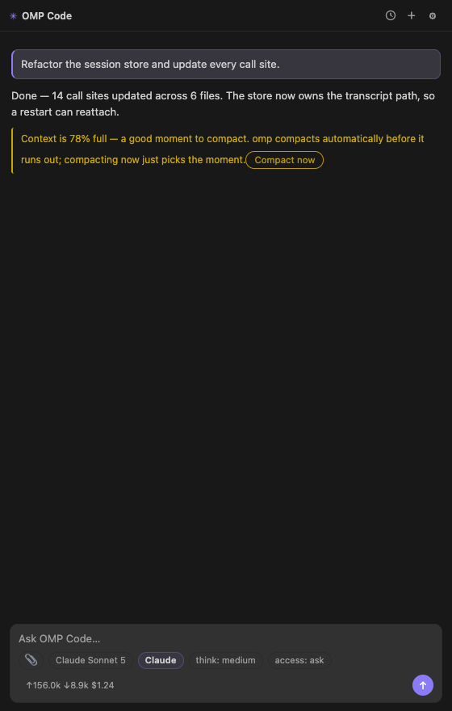
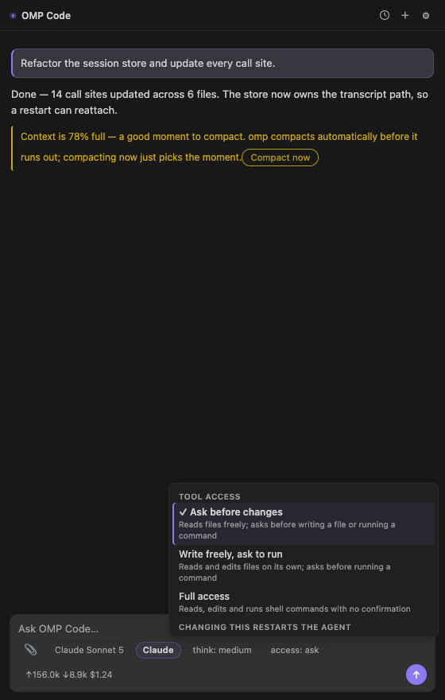
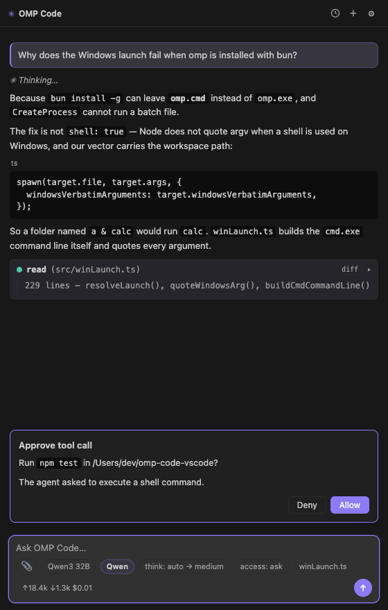
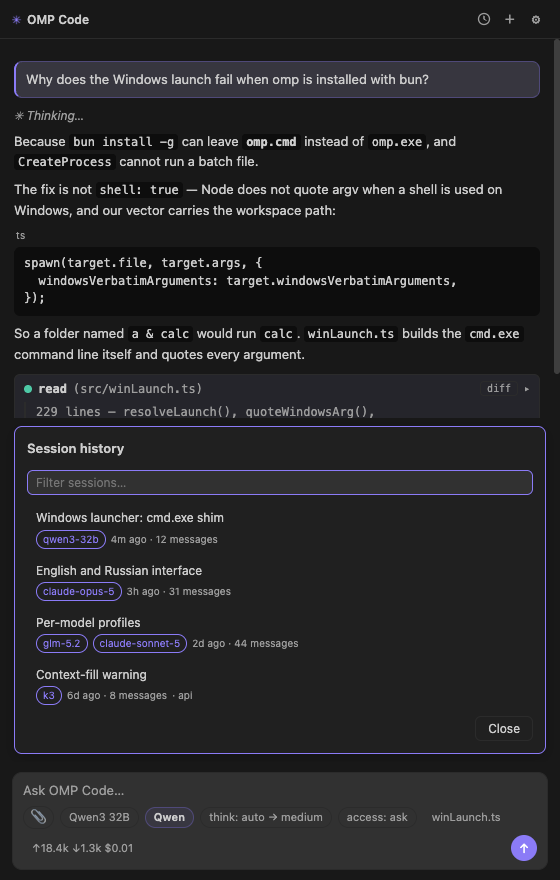
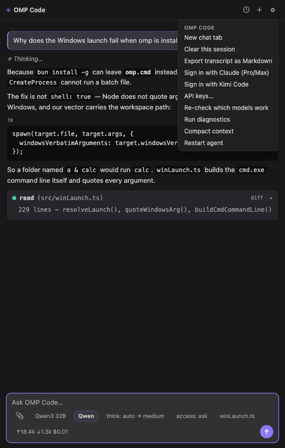
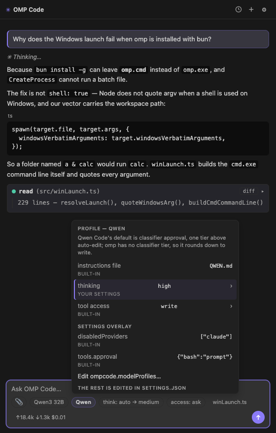
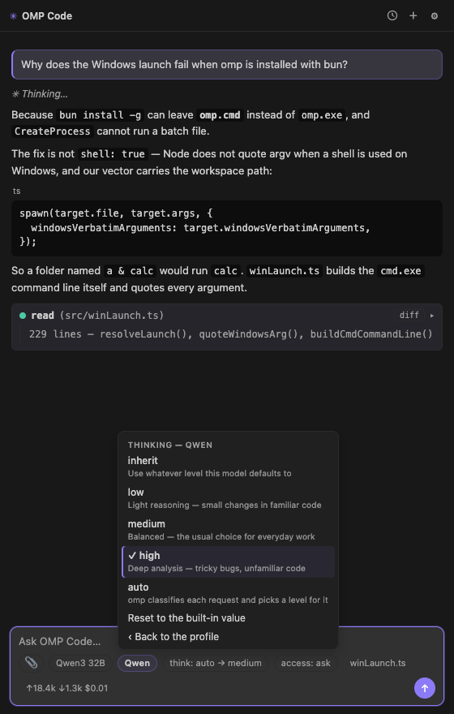

# OMP Code

[](https://github.com/cryptotyan-star/omp-code-vscode/actions/workflows/ci.yml)
[](LICENSE)
[](https://code.visualstudio.com/)

**Кодинг-агент в стиле Claude Code внутри VS Code — на той модели, за которую вы уже платите.**

🇬🇧 [English version](README.md)

<p align="center">
  
</p>

OMP Code — панель чата для CLI-агента [`omp`](https://www.npmjs.com/package/@oh-my-pi/pi-coding-agent)
(oh-my-pi). Он читает и правит файлы, запускает команды и отвечает потоковым markdown —
рабочий цикл тот же, что у Claude Code, только модель под ним выбираете вы: Claude, GLM,
Qwen, Kimi или любой OpenAI-совместимый эндпоинт.

> Расширение — **только GUI**. Все вызовы моделей, инструментов и сессии принадлежат CLI
> `omp`, который ставится отдельно; без этого бинарника панель не стартует. Отсюда же и
> приватность: ключи и код уходят ровно туда, куда их отправляет `omp`, и никуда больше —
> у расширения нет ни сервера, ни телеметрии, ни аккаунта.

> **Не аффилировано** с проектом oh-my-pi, Anthropic и любым провайдером моделей — это
> независимый клиент, общающийся с CLI `omp` по его RPC-интерфейсу.

---

## Содержание

- [Что это даёт](#что-это-даёт)
- [Как тратить меньше](#как-тратить-меньше)
- [Установка](#установка)
- [Вход](#вход)
- [Возможности подробно](#возможности-подробно)
- [Профили моделей](#профили-моделей)
- [Настройки](#настройки)
- [Команды и горячие клавиши](#команды-и-горячие-клавиши)
- [Кастомные провайдеры](#кастомные-провайдеры)
- [Язык](#язык)
- [Платформы](#платформы)
- [Если что-то не работает](#если-что-то-не-работает)

---

## Что это даёт

| | |
| --- | --- |
| **Одна панель, любая модель** | Claude, GLM, Qwen, Kimi и кастомные OpenAI-совместимые провайдеры в одном списке. Переключение прямо посреди диалога. |
| **Ваша подписка вместо счёта за API** | Вход в один клик для Claude Pro/Max и Kimi Code. Для них ключ не нужен вообще. |
| **Реальная стоимость на виду** | Токены на вход, на выход и потраченные доллары — обновляются после каждого хода. |
| **Мёртвые модели не мешают** | Каждая модель проверяется одним пробным запросом; те, что отвечают 401, до списка не доходят. |
| **Доступ инструментов на поводке** | Три уровня — от «спрашивать перед каждой правкой» до полностью автономного. Плюс правила под конкретный инструмент. |
| **Профили под семейства моделей** | Модель ведёт себя так, как её заставляет вести себя её родной харнесс: файл инструкций, уровень рассуждений, уровень подтверждений. |
| **Сессии не теряются** | История по всем рабочим папкам, с поиском и продолжением. После падения агент переподключается, а не начинает с нуля. |
| **Русский и английский** | Независимо от языка интерфейса VS Code. |

---

## Как тратить меньше

Сразу честно: **расширение не делает токены дешевле.** Оно делает видимым то, что вы
тратите, и упрощает отправку каждой задачи самой дешёвой модели, которая с ней справится.
Конкретно:

**1. Использовать подписку, за которую уже заплачено.**
`Sign in with Claude (Pro/Max)` и `Sign in with Kimi Code` — это OAuth: агент работает на
вашем действующем тарифе, а не на тарифицируемом ключе. Ничего не пополнять, нечему утечь.

<p align="center"></p>

**2. Отдавать работу дешёвой модели — но так, чтобы она вела себя прилично.**
В списке сгруппированы все модели, которые реально открывают ваши доступы. Модели
кодинг-планов (Qwen, GLM, Kimi) стоят рядом с фронтирными, а [профили](#профили-моделей)
заставляют каждое семейство вести себя как в его родном инструменте — так что дешёвый
вариант годится для рутинных 80% дня, а дорогой остаётся на то, что этого требует.

<p align="center"></p>

**3. Не платить за рассуждения, которые не нужны.**
Токены рассуждений тарифицируются как обычный выход. Чип `think:` задаёт уровень на
сессию, профиль закрепляет его за семейством, а `auto` отдаёт решение omp — тот оценивает
каждый запрос вместо того, чтобы думать изо всех сил над каждым.

**4. Видеть счёт до того, как он придёт.**
В подвале композера — `↑вход ↓выход $стоимость` за сессию, обновляется каждый ход. На
наведении добавляются токены рассуждений и чтение кэша: обычно сюрприз прячется именно там.

**5. Не разносить окно контекста по неосторожности.**
На 50%, 75% и 90% заполнения панель говорит об этом и предлагает сжать контекст в один
клик, вместо того чтобы дать длинной сессии тихо стать дорогой.

<p align="center"></p>

**6. Не жечь ходы на протухшем ключе.**
При включённом `ompcode.verifyModels` (по умолчанию) каждая модель получает один
крошечный пробный запрос, и те, которых ключ или тариф не покрывает, скрываются.
Альтернатива — обнаружить мёртвый ключ на третьем ходу задачи — обходится куда дороже
самой проверки. Вердикты кэшируются на 12 часов.

---

## Установка

**1. Поставьте агента.** Расширение — GUI поверх него:

```bash
bun install -g @oh-my-pi/pi-coding-agent
```

Нет `bun`? `curl -fsSL https://bun.sh/install | bash`, затем перезапустите терминал.
Расширение ищет `omp` в `PATH` (`~/.bun/bin` добавляется автоматически); свой путь —
в настройке `ompcode.ompPath`.

**2. Поставьте расширение.** Скачайте `.vsix` из
[Releases](https://github.com/cryptotyan-star/omp-code-vscode/releases) и либо перетащите
его в панель Extensions, либо выполните:

```bash
code --install-extension omp-code-<версия>.vsix
```

Или соберите из исходников:

```bash
git clone https://github.com/cryptotyan-star/omp-code-vscode.git
cd omp-code-vscode
npm install && npm run build && npm run package
```

**3. Откройте чат.** Иконка OMP Code в activity bar, либо `Cmd/Ctrl+Alt+O` — чат откроется
вкладкой редактора рядом с кодом.

> Обновляетесь со сборки старше 0.5.0? У расширения сменился идентификатор, поэтому новая
> версия встанет **рядом** со старой — две иконки и задвоенные команды. Уберите старую:
> `code --uninstall-extension local.omp-code`, затем перезагрузите окно.

---

## Вход

Два способа, их можно смешивать:

**Подписка (OAuth).** `OMP Code: Sign in with Claude (Subscription)` или
`… with Kimi Code (Subscription)` — они же в меню ⚙ и на карточке настройки. Откроется
вкладка браузера; если провайдер попросит код обратно, панель покажет его с кнопкой
копирования. Учётные данные лежат в хранилище самого агента и переживают обновления
расширения.

**API-ключи.** У Anthropic, Kimi (Moonshot), GLM (Zhipu BigModel) и Qwen (Alibaba Coding
Plan) есть команда в палитре и поле на карточке. Ключи хранятся в **VS Code Secret
Storage** — не в `settings.json` — и передаются процессу агента переменными окружения.

Ключ, начавший отвечать 401, расширение показывает отдельно и предлагает удалить: протухший
ключ хуже отсутствующего, потому что провайдер продолжает предлагать весь свой набор
моделей, и каждая из них падает.

---

## Возможности подробно

### Диалог

Потоковый markdown с подсветкой синтаксиса, сворачиваемые блоки рассуждений и карточка на
каждый вызов инструмента — с аргументами, статусом и выводом. После правки на карточке
появляется кнопка **diff** (до ↔ сейчас), а новые диагностики языкового сервера всплывают
предупреждением: видно, что агент сломал, не выходя из панели.

`/` — slash-команды агента, `@` — автодополнение файлов рабочей папки прямо в промпт.
Вложения — 📎, `Ctrl/Cmd+V` или `Shift`+перетаскивание. `Cmd/Ctrl+Alt+L` отправляет
выделение из редактора вместе с диапазоном строк. `Shift+Enter` — перенос строки,
`Esc` — прервать ход.

### Доступ инструментов

Три уровня, меняются чипом `access:` и применяются перезапуском агента.

<p align="center"></p>

| Уровень | Чтение | Запись файлов | Запуск команд |
| --- | --- | --- | --- |
| `always-ask` | авто | спрашивает | спрашивает |
| `write` | авто | авто | спрашивает |
| `yolo` | авто | авто | **авто** |

Всё, что спрашивает, открывает диалог в панели с именем инструмента и аргументами:

<p align="center"></p>

> Честная оговорка: подтверждение одного вызова `task` отдаёт его субагенту тот же уровень,
> поэтому одобренная задача может запускать команды без повторного спроса. Правила под
> конкретный инструмент (`tools.approval` в оверлее профиля) соблюдаются даже под `yolo` —
> это надёжный способ закрыть один инструмент наглухо.

### История сессий

Все сессии по всем рабочим папкам, с фильтром по названию, превью, папке и модели. Выбор
переподключает агента к сессии и проигрывает транскрипт.

<p align="center"></p>

`Export transcript as Markdown` выгружает весь диалог в файл.

### Всё остальное — в меню ⚙

<p align="center"></p>

---

## Профили моделей

Модель ведёт себя так, как её заставляет вести себя её родной харнесс. Claude Code читает
`CLAUDE.md` и подтверждает консервативно; Qwen Code читает `QWEN.md` и по умолчанию на
уровень свободнее; ZCode и Kimi Code читают `AGENTS.md` со своими настройками рассуждений.
Вы выбираете модель — OMP Code подтягивает конвенции её семейства, а не одну общую
настройку на всё.

Бейдж рядом с чипом модели называет семейство. Клик открывает инспектор, где видно каждое
значение **и откуда оно взялось** — встроенное или ваше:

<p align="center"></p>

`thinking` и `tool access` редактируются прямо здесь: клик по строке, выбор значения — и
оно записывается в `ompcode.modelProfiles` правилом для всего семейства.

<p align="center"></p>

> Это не те же чипы `think:` / `access:` в другом виде. Чипы правят **текущую сессию**,
> профиль — постоянное правило для **всех моделей семейства**, поэтому его изменение
> перезапускает агента. Перезапуск тёплый: диалог переезжает.

У переопределённого вами поля появляется пункт *вернуть встроенное значение*. Оверлей и
файл инструкций остаются в `settings.json` — переход туда есть в том же меню.

Встроенные семейства: `claude`, `glm`, `qwen`, `kimi` и `generic` как основа для всего
неопознанного. Ваши строки всегда выигрывают у встроенных:

```jsonc
"ompcode.modelProfiles": [
  {
    "family": "qwen",
    "match": { "id": "qwen" },          // регулярка строкой, регистр не важен
    "runtime": { "thinking": "high" },   // применяется по RPC, без перезапуска
    "spawn": {                           // доходит до omp через argv — нужен перезапуск
      "approvalMode": "always-ask",
      "overlay": {
        "disabledProviders": ["claude"],
        "tools.approval": { "bash": "deny" }   // работает даже под yolo
      }
    }
  }
]
```

Здесь место только политике: диалект мышления, лестницу усилий, таймауты стрима и форму
схемы инструментов omp уже разбирает по провайдеру сам, и переопределение делает хуже.

---

## Настройки

| Настройка | По умолчанию | Что делает |
| --- | --- | --- |
| `ompcode.ompPath` | `omp` | Путь к бинарнику omp. |
| `ompcode.language` | `auto` | Язык чата: `auto`, `en`, `ru`. |
| `ompcode.defaultModel` | `""` | `provider/modelId` при старте, нестрогое совпадение. |
| `ompcode.verifyModels` | `true` | Проверять каждую модель и скрывать нерабочие. |
| `ompcode.thinkingLevel` | `auto` | `off`…`max` либо `auto`. |
| `ompcode.approvalMode` | `always-ask` | `always-ask`, `write`, `yolo`. |
| `ompcode.modelProfiles` | `[]` | Профили под семейства, поверх встроенных. |
| `ompcode.customProviders` | `{}` | Дополнительные провайдеры для `models.yml`. |
| `ompcode.resumeLastSession` | `false` | Новый чат продолжает последнюю сессию. |
| `ompcode.hideStartupNotices` | `true` | Прятать стартовые сообщения агента. |
| `ompcode.theme` | `violet` | Палитра: violet, coral, emerald, amber, magenta. |
| `ompcode.accentColor` | `""` | Свой CSS-цвет вместо палитры. |

---

## Команды и горячие клавиши

| Клавиши | Действие |
| --- | --- |
| `Cmd/Ctrl+Alt+O` | Открыть чат вкладкой редактора |
| `Cmd/Ctrl+Alt+N` | Новая вкладка чата |
| `Cmd/Ctrl+Alt+L` | Отправить выделение в чат |
| `Shift+Enter` | Перенос строки в композере |
| `Esc` | Прервать текущий ход |
| `↑` | Предыдущий промпт |

Все шестнадцать команд — в палитре под **OMP Code:**: вход, ключи, models.yml,
диагностика, перезапуск, экспорт, история.

---

## Кастомные провайдеры

Любой OpenAI-совместимый эндпоинт через `ompcode.customProviders` — вливается в
`~/.omp/agent/models.yml` перед каждым стартом, комментарии сохраняются:

```json
"ompcode.customProviders": {
  "akemi": {
    "baseUrl": "http://host:8000/v1",
    "api": "openai-completions",
    "models": [
      { "id": "akemi-1", "name": "Akemi", "contextWindow": 128000, "maxTokens": 32000 }
    ]
  }
}
```

Ключ такого провайдера — в Secret Storage, а не в файле настроек:
`OMP Code: Set Custom Provider API Key`.

---

## Язык

Интерфейс есть на русском и английском. Настройка `ompcode.language` (по умолчанию `auto`)
**не зависит от языка интерфейса VS Code**: редактор может остаться английским, а чат быть
русским, Language Pack не нужен. Названия команд и описания настроек VS Code читает до
загрузки расширения — только они следуют языку редактора.

---

## Платформы

Чистый JavaScript, без нативных модулей — `.vsix` ставится на macOS, Linux и Windows.
Нативная часть только у CLI `omp`, и он публикует сборки под `darwin-arm64`,
`darwin-x64`, `linux-x64`, `linux-arm64` и `win32-x64`. **Windows на ARM не
поддерживается** — сборки `win32-arm64` у omp нет.

На Windows глобальная установка может оставить `omp.cmd` вместо `omp.exe`. С версии 0.5.0
расширение ищет путь так же, как это делает Windows (`PATH` × `PATHEXT`), и запускает
такую обёртку через `cmd.exe`, квотируя командную строку само — настраивать ничего не надо.

---

## Если что-то не работает

Запустите **OMP Code: Run Diagnostics** из палитры. Отчёт покажет найденный путь к
бинарнику, вывод `omp --version`, проходит ли хендшейк, у каких провайдеров есть учётные
данные, какие модели предлагает агент и последние вердикты проверки — значений ключей в
нём нет, так что его безопасно приложить к issue.

Что он обычно объясняет:

- **«Cannot find the omp binary»** — CLI не установлен либо не в том `PATH`, который видит
  VS Code. Укажите полный путь в `ompcode.ompPath`.
- **Ничего не отвечает, везде 401** — протухший ключ. Удалите его командой
  `OMP Code: Clear Stored API Key`; входы по подписке это не затронет.
- **Список моделей короткий** — проверка скрыла нерабочие. Пункт *Show all models* в
  выборе модели их покажет, *Re-check subscriptions* перезапустит проверку.

---

## Разработка

Сборка, тесты и грабли протокола — в [CONTRIBUTING.md](CONTRIBUTING.md),
история версий — в [CHANGELOG.md](CHANGELOG.md).

## Лицензия

[MIT](LICENSE) © Ilona Pushilina
